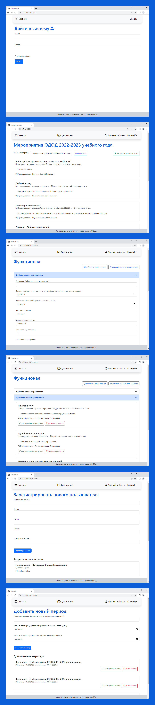

## Teaching Report Flask
### Информационная система "Мониторинг участия преподавателей ОДОД в плановых мероприятиях".
### Ver.0.2.0
>ИС позволяет вести базу данных мероприятий, в которых участвуют педагоги дополнительного образования, с возможностью выгрузки отчетов. Работа системы реализована на сервере образовательного учреждения, на виртуальной машине под выделенным IP.

#### Используемые технологии:
+ Flask (основа)
+ Flask-WTF (формы)
+ Flask-Login (авторизация)
+ Werkzeug (кеш паролей)
+ SQLAlchemy (работа с БД)
+ Openpyxl (импорт в файл)
+ Tempfile (генерация файла)

> 
> 
> 
> 
> 
> 
> 
> 

#### На момент версии 0.2.0 реализован функционал:
> - основной пользовательский интерфейс;
> - авторизация пользователей (педагогов ДО);
> - просмотр сводной ведомости всех мероприятий на главной странице с возможностью фильтрации;
> - импорт списка мероприятий в файл формата .xlsx;
> - страница "функционал" с формой добавления/редактирования/удаления мероприятий;
> - регистрация новых пользователей администратором;
> - добавление/удаление периодов мероприятий для фильтрации.

#### Доступные пользователи (для тестирования):
> #### логины:
> + popov  (администратор)
> + glush
> + kotel
> + tupol
> + korol
>
>#### пароль для всех: 123456

### Стартовый файл index.py

#### В планах реализация:
> - личный кабинет пользователя;
> - добавление видов пользовательского доступа;
> - добавление таблиц "курс/объединение" с привязкой к пользователю и мероприятию;
> - прикрепление фотографий к мероприятиям;
> - план будущих мероприятий;
> - оповещение пользователей о необходимых действиях;
> - ...

### скрины рабочих запусков:

